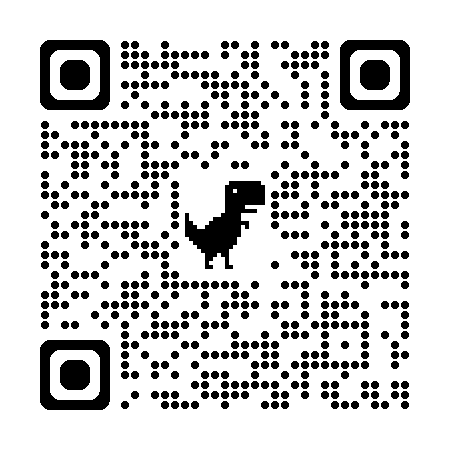
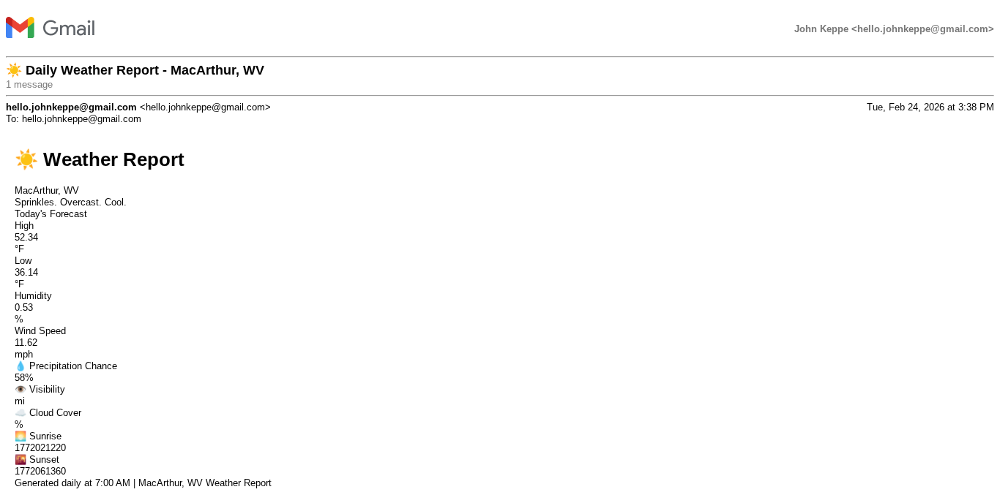

# Hi, I'm John Keppe  

### 🚀 Professional Summary

I am a Detail-oriented Professional with over 15 years of experience in administration, customer service, and data management. My current focus is bridging the gap between traditional administrative support and modern data visualization. I leverage my background in operational efficiency to develop technical solutions that streamline workflows and support data-informed decisions.

### 🛠️ Technical Toolkit

- **Web Development:** Building responsive web projects using HTML/CSS.

- **Data Analysis:** Mastering Microsoft Excel (Pivot Tables, Slicers, Data Modeling).

- **Automation:** Building automated workflows using Zapier to integrate platforms like Notion and Slack.

- **Productivity:** Power user of Google Workspace and Microsoft Office.

### 📈 Highlighted Impact

- **Efficiency Expert:** Achieved a 50% reduction in turnaround time for transcript processing at Mountain State University.

- **Cost Savings:** Managed tech support and website maintenance, saving $2,000+ annually.

- **Data Integrity:** Digitized archived transcripts and accurately managed sensitive financial data in tax preparation roles.

- **Automation:** Currently exploring AI tools to enhance material generation and workflow efficiency.

<table>
  <tr>
    <td>
      <h3>Explore My Notion Resume Page</h3>
      
I use Notion to manage my 15+ years of administrative data and technical projects. 
      Scan to see how I bridge the gap between operations and automation.

    </td>
    <td align="center">
      
       
      Scan Me
    </td>
  </tr>
</table>

--- 

This is a fantastic addition to your README because it proves you aren't just "learning" automation—you are actively using it to solve real-world needs. In the world of Administrative Operations, showing that you can "vibe code" a solution to deliver data exactly when and where it's needed is a huge selling point.

Since this is a daily screenshot, you can frame it as your "Automated Morning Briefing."

## 🌦️ Automated Morning Briefing (Zapier + Gmail)

I built a custom automation to streamline my morning routine and ensure I’m always prepared for the day ahead in Beckley, WV. Using a "vibe coding" approach with Zapier, I've created a hands-off workflow that delivers critical data directly to my inbox.

- **The Workflow:** Every morning at 7:00 AM, a Zap triggers to fetch the latest local weather data.

- **The Output:** The system captures a snapshot of the report and emails it to my job-search Gmail.

- **The Purpose:** This project demonstrates my ability to integrate third-party APIs (Weather) with communication tools (Gmail) to enhance personal and professional efficiency.

### 📸 Daily Weahter Report Preview

Note: Image of my automated workflow.

HTML

  
   
  <i>Automated Screenshot delivered daily at 7:00 AM EST</i>

### 🛠️ The Tech Behind the "Vibe"

- **Trigger:** Schedule by Zapier (Daily at 7 AM).

- **Action:** Webhook/API call to weather data services.

- **Delivery:** Automated HTML email generation sent to hello.johnkeppe@gmail.com.

- **Integration:** Demonstrates the same logic I use to connect Notion and Slack for team-wide transparency.

---

### 📫 Connect with Me

**Location:** Beckley, WV 

**Email:** hello.johnkeppe@gmail.com 

**Goal:** Seeking to apply my administrative expertise and technical proficiency to help organizations optimize their operations.
